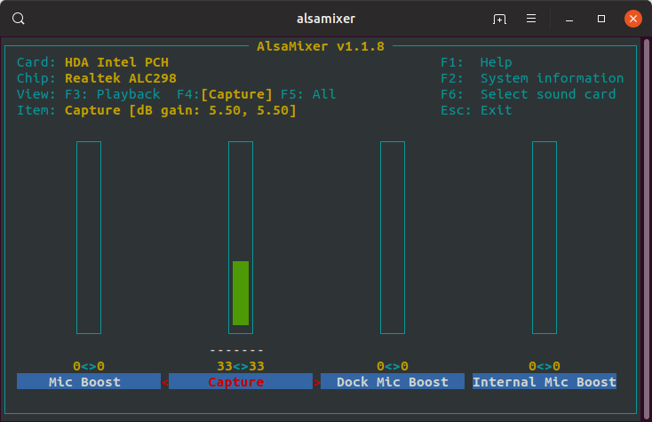
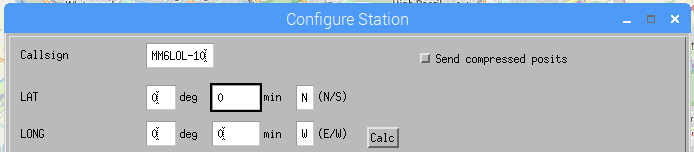
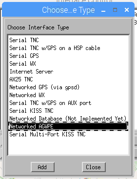
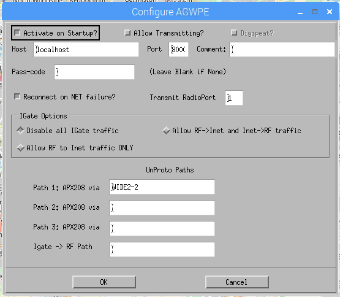
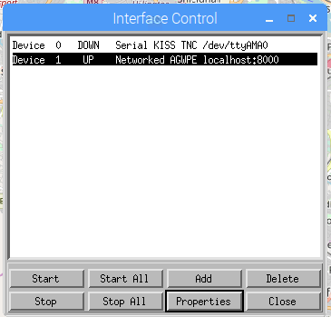

README
======

Below are some notes on setting up a receive-only iGate for APRS traffic. My
use case doesn't require transmit functionality, but if it does, the note will
be updated to reflect that. 

This covers both setting up a radio and SDR as the receiving device on
Raspberry OS, which should translate to other Debian based distros, but hasn't
been tested as such. 

Direwolf installation
----------------------

Run the below command in a terminal window to install the prereqs. Some (if
not all!) of these may already be installed. 

Setting up for receiving on the radio

    $ sudo apt install libasound2-dev libudev-dev cmake make gcc g++ libudev-dev git ax25-tools ax25-apps xastir 

If you're planning on using an SDR instead, in addition you'll need the
`rtl-sdr package`.

	$ sudo apt install rtl-sdr direwolf

We're going to pull down the source for Direwolf and compile it on the
computer locally. If you're not sure about what you're doing, copying and
pasting the below lines into the terminal will be enough to get everything
running, but do have a read over the [documentation](https://github.com/wb2osz/direwolf/).

	$ cd ~
	$ mkdir repos && cd repos
	$ git clone https://www.github.com/wb2osz/direwolf
	$ cd direwolf
	$ git checkout dev
	$ mkdir build && cd build
	$ cmake ..
	$ make -j4
	$ sudo make install
	$ make install-conf

Configuration
-----------------------

Identifying Audio Devices
-------------------------

This section covers configuring when using a radio connected to a USB sound
card. If you're using an SDR device, scroll down to the `SDR` section.

Before attaching the USB sound card, run the below command in a terminal
window to see what your setup looks like as it is. The below command lists
playback devices.


	$ aplay -l

My output...

	$ ~/Downloads$ aplay -l
	**** List of PLAYBACK Hardware Devices ****
	card 0: PCH [HDA Intel PCH], device 0: ALC269VC Analog [ALC269VC Analog]
	  Subdevices: 1/1
	  Subdevice #0: subdevice #0
	card 0: PCH [HDA Intel PCH], device 3: HDMI 0 [HDMI 0]
	  Subdevices: 1/1
	  Subdevice #0: subdevice #0
	card 0: PCH [HDA Intel PCH], device 7: HDMI 1 [HDMI 1]
	  Subdevices: 1/1
	  Subdevice #0: subdevice #0
	card 0: PCH [HDA Intel PCH], device 8: HDMI 2 [HDMI 2]
	  Subdevices: 1/1
	  Subdevice #0: subdevice #0 

Then attach the USB sound card and run the same command again. Look out for
the change as this is what you'll need to take note of for Direwolf to capture
and output audio. 

	$ ~/Downloads$ aplay -l
	**** List of PLAYBACK Hardware Devices ****
	card 0: PCH [HDA Intel PCH], device 0: ALC269VC Analog [ALC269VC Analog]
	  Subdevices: 1/1
	  Subdevice #0: subdevice #0
	card 0: PCH [HDA Intel PCH], device 3: HDMI 0 [HDMI 0]
	  Subdevices: 1/1
	  Subdevice #0: subdevice #0
	card 0: PCH [HDA Intel PCH], device 7: HDMI 1 [HDMI 1]
	  Subdevices: 1/1
	  Subdevice #0: subdevice #0
	card 0: PCH [HDA Intel PCH], device 8: HDMI 2 [HDMI 2]
	  Subdevices: 1/1
	  Subdevice #0: subdevice #0 
	card 1: Device [C-Media USB Audio Device], device 0: USB Audio [USB Audio]

The device listed as USB Audio Device is what I'm looking for here. Yours
might state a brand or model name. The two things we are taking note of are
the card number and the device number. In my case, 1 and 0.

You can also run the below to check the recording device, but this usually
matches the same as what is shown for the playback device.

	$ arecord -l


Setting Your Callsign
------------------------

Right now we'll configure Direwolf as read only and can add to the
configuration later on to increase functionality. Open up direwolf.conf in
your home directory using your favourite text editor. If you can't see it in
the home directory, it may be in ~/git/direwolf. You can either switch to that
directory and edit the file within there or move it to another location. For
ease of use, I keep direwolf.com in the root of my home directory.

Change `MCALL NOCALL` to `MYCALL YOUR-CALL-SIGN` and append '-10'. So for
example `MM6LOL-10`. The '-10' is a SSID used to show you are operating on
this device from a static, home station in my case. [APRS.org
SSIDs](http://aprs.org/aprs11/SSIDs.txt).


	MYCALL MM6LOL-10

Setting the Audio Device to Use
----------------------------------

Remove the # from ADEVICE so that it looks like the below. If the output noted
from `aplay -l` was 1 and 0, you can leave the rest as it is. If it differs,
change the numbers to match what you noted. Enter the card number first,
followed by the device number.

	ADEVICE plughw:1,0

Save and close the file. That should be enough to get everything up and
running as read only.

Linking to aprs.fi
------------------

...

Running Direwolf
================

To start Direwolf, simply open up a terminal or use the existing one you have
open and type in the below. Make sure you're operating from the directory
direwolf.conf is in. Running direwolf without any additional switches causes
the application to look for a config file in the directory you're currently
operating from.

	$ direwolf

If you have the audio levels correct and you're tuned into the 2M APRS
frequency for your country (144.800MHz in the UK), you should start to see
APRS packets decoding and displaying in the terminal. 

)

If you don't see anything, unplug the audio cable from your radio and confirm
that you are hearing APRS packets through the loud speaker. 

If you are hearing audio, plug back in and adjust the audio levels (see
below), waiting some time between each change as you may not be receiving a
steady stream of packets depending on your location.

Tweaking Audio
--------------

Next we'll analyse the audio levels that are reported by Direwolf.

If you look at my example above, the first line in each packet shows the audio
level received by Direwolf.


	MB7USI-1 audio level = 103(44/20) [NONE]

Direwolf recommends that the audio level for most packets should be around 50,
where 103 is currently shown above. You'll find that in most cases, this isn't
a problem till you get a prompt from direwolf under the audio level advising
that you should reduce the audio levels.

I turn the volume down on the radio initially to bring as close to 50 as
possible. If after playing about with the radio you still find levels aren't
as low as you want, we can start playing about with alsamixer.

From the terminal, type `alsamixer` and hit return. You'll see a GUI within
the terminal showing various audio levels. Out of the box, this will show the
devices default audio adapter. If you are using a USB device, you may need to
switch to that device specifically by pressing F6 and selecting the USB
device.



Once you are controlling the correct device, press F4 to switch to the audio
capture settings. You'll see a bar, which can be manipulated by using the up
and down arrow keys on your keyboard. Adjust this down slightly, press ESC on
the keyboard and head back into Direwolf to see if the levels have dropped. If
they haven't dropped enough, repeat the steps above till you're happy.

Logging
-------

If you want to save Direwolf activity, you can define a directory to save the
logs to in the direwolf.conf file in the format below. In my case, I've
created `/home/user/logs/dw`. Make sure that the directory you enter for
saving logs to exists.

**Note** that if you are running Raspberry Pi OS off of a SD card, logging
reduce the life of the card. If you're in a relatively quiet area, this wont
be a problem, but if you are, it would be worth looking into booting off of
an external drive or exporting logs to a logging server. I may expand on
these options in the future. For now, I'm keeping the logs in `~/logs/dw`,
but it would make sense to have in `/var/logs/...`.

From the CLI

	$ mkdir -p ~/logs/dw

Then edit direwolf.conf to add

	LOGDIR ~/logs/dw

Save the file and restart direwolf for the changes to apply.

Disabling Colours
------------------

I find the Direwolf font and background colours a bit overwhelming. To disable
this, you can add '-t 0' to the command you use to start Direwolf. i.e.

	$ direwolf -t 0

SDR
----

The process differs a bit here. We're using a different configuration file.

Plug in the SDR and check that it's recoginised by the OS.

	$ lsusb
	Bus 002 Device 001: ID 1d6b:0003 Linux Foundation 3.0 root hub
	Bus 001 Device 004: ID 04d9:0007 Holtek Semiconductor, Inc.
	Bus 001 Device 006: ID 0bda:2838 Realtek Semiconductor Corp. RTL2838 DVB-T
	Bus 001 Device 002: ID 2109:3431 VIA Labs, Inc. Hub
	Bus 001 Device 001: ID 1d6b:0002 Linux Foundation 2.0 root hub

I'm using a NESDR SMArt device, which shows above as `BUS 001 DEVICE 006: ... RTL2838 DVB-T`. Good!

In place of `direwolf.conf`, there's a dedicated SDR configuration file called
`sdr.conf`, where we will be applying our changes to.

Edit `sdr.conf`, adding in your callsign.

	ADEVICE null null
	CHANNEL 0
	MYCALL MM6LOL-10

And further down in the file, modifying the `IDLOGIN` line to match your
callsign and [APRS passcode](https://apps.magicbug.co.uk/passcode/).

	IGLOGIN MM6LOL-10 12345

You can also add in beacon settings, if you wish, configuring how packets you
pick up are passed onto the APRS servers for viewing online. 

I've added this to the bottom of the file -- if you plan on doing this, you'll need to update your coordinates. 

	PBEACON sendto=IG delay=0:30 every=60:00 symbol="igate" overlay=R lat=55^53.05N long=004^17.22W
	
Additionally, you can add in the log parameters mentioned further up. 

We're now ready to go for a test run using the SDR.

	$ rtl_fm -f 144.8M - | direwolf -c sdr.conf -r 24000 -D 1 -

If working, you should see something similar to the below when receiving APRS
packets.

	MB7USI-1 audio level = 34(13/19)   [NONE]   |||||||__
	[0.3] MB7USI-1>U5USPW,WIDE1-1:`z-5l <0x1c>-/"4>}Glasgow North West i Gate AVRT6
	MIC-E, House, Unknown manufacturer, In Service
	N 55 53.0700, W 004 17.2500, 0 MPH, alt 128 ft
	Glasgow North West i Gate AVRT6

If you know packets are being transmitted, but you're not picking anything up,
you may need to tune the SDR (or check your antenna). To tune the SDR, run
`rtl_test -p` and leave it running for a bit.

	$ rtl_test -p
	Found 1 device(s):
	  0:  Realtek, RTL2838UHIDIR, SN: 00000001
	Using device 0: Generic RTL2832U OEM
	Detached kernel driver
	Found Rafael Micro R820T tuner
	Supported gain values (29): 0.0 0.9 1.4 2.7 3.7 7.7 8.7 12.5 14.4 15.7 16.6 19.7 20.7 22.9 25.4 28.0 29.7 32.8 33.8 36.4 37.2 38.6 40.2 42.1 43.4 43.9 44.5 48.0 49.6
	[R82XX] PLL not locked!
	Sampling at 2048000 S/s.
	Reporting PPM error measurement every 10 seconds...
	Press ^C after a few minutes.
	Reading samples in async mode...
	Allocating 15 zero-copy buffers
	lost at least 116 bytes
	real sample rate: 2048913 current PPM: 446 cumulative PPM: 446
	real sample rate: 2047856 current PPM: -70 cumulative PPM: 182
	real sample rate: 2048084 current PPM: 41 cumulative PPM: 134
	...

In my case, I didn't have any issues picking up APRS traffic, but after
leaving for X minutes, the `cumulative PPM` output started to normalise at
around 19. 

	real sample rate: 2047848 current PPM: -74 cumulative PPM: 19

Now to apply the PPM value to the `rtl_fm` command, seen below as `-p 19 -`. 

	$ rtl_fm -f 144.8M -p 19 - | direwolf -c sdr.conf -r 24000 -D 1 -

Again, if you're not having issues picking up on APRS traffic, there's no need
for this extra step. 

I've added in a couple of extra parameters that I've found to be useful. Logging [timestamps](https://github.com/wb2osz/direwolf/issues/221) and gain. When launching, the command now looks like

```
rtl_fm -f 144.80M -g 48.0 - | direwolf -c sdr.conf -r 24000 -D 1 -t 0 -T %H:%M:%S -
```
Where `-g 48.0` is the gain applied (still playing around with the actual number) and `-T %H:%M:%S` is the timestamp applied to each of the log entries. Without this, it's hard to tell exactly when you decoded a packet and compare with other sources. 

Direwolf Summary
-----------------

For the most part, that's you up and running with a receive only Direwolf
setup! There are some additional configurations that you can apply, detailed
further down, but for more information, check the Direwolf manpage or head to
the Github repo and view the documentation there. There's a lot to be learned
from it! To add Xastir into the mix, move on.

Xastir
======

On starting Direwolf, you'll see a line right at the beginning like the below.
By default the port will be 8000. If you've altered the configuration file,
you may see something different.

	Ready to accept AGW client application 0 on port 8000 ...                       

With that information, open Xastir by running the below in a terminal window.

	$ sudo xastir &

When you first launch, you'll be asked to enter your callsign and SSID. If
you're planning to use receive only, you can skip this, but in case you want
to transmit in the future, it's recommended that you enter the details there.

)

The location co-ordinates can be entered later.

On the application menu bar, select 'Interface' then 'Interface Control'

Select 'Add' and when the new window appears, select 'Networked AGWPE' and
press 'Add'



By default, everything should work from here, but I change a couple of
additional options:

- Deselect 'Allow Transmitting'
- Select 'Reconnect on NET faulure'



Press 'OK'

You'll see that the Interface Control window has updated with the settings
you've configured and the status should be set to up. If not, select 'Start'
or 'Start All' if you only have one item configured. 



If successful, switch back to the Direwolf terminal window and you'll see the
below line confirming the connection.

	Connected to AGW client application 0...

If Direwolf isn't running, run it again from the terminal, head back to
Xastir, select "Start' within the Interface Control settings and check
everything again.

You should now see activity show up within Xastir. With this setup, you have
the best of both worlds. Direwolf is logging the data and sending to aprs.fi
and Xastir is connecting to Direwolf and displaying the data it receives.

Sources
------------

https://ww8tf.club/building-an-aprs-igate/  
https://tonyblews.co.uk/linux-sdr-aprs-igate-setup/  
