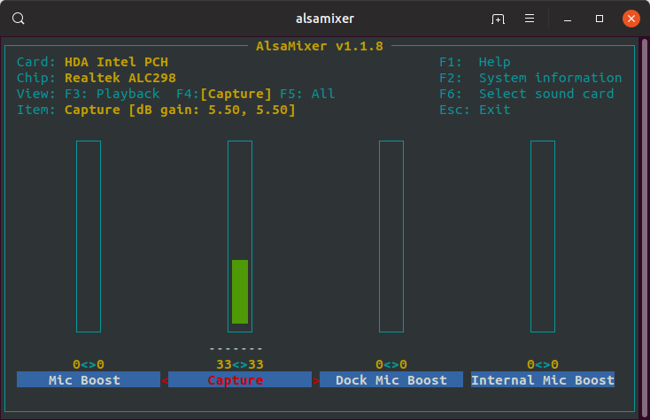

README
======


# Installation on debian based distros

Install prereqs: libasound2-dev, xastir, ax25-tools, ax25-apps, git

Run the below command in a terminal window to install the prereqs:

```
sudo apt-get install libasound2-dev xastir ax25-tools ax25-apps git
```

We're going to pull down the source for Direwolf and compile it on the computer locally. If you're not sure about what you're doing, copying and pasting the below lines into the terminal will be enough to get everything running.

```
cd ~
mkdir git
cd git
git clone https://www.github.com/wb2osz/direwolf
cd direwolf
make
sudo make install
```

# Direwolf Configuration

## Identifying Audio Devices

Before attaching the USB sound card, run the below command in a terminal window to see what your setup looks like as it is. The below command lists playback devices.

```
aplay -l
```
My output:

```
sj@x230:~/Downloads$ aplay -l
**** List of PLAYBACK Hardware Devices ****
card 0: PCH [HDA Intel PCH], device 0: ALC269VC Analog [ALC269VC Analog]
  Subdevices: 1/1
  Subdevice #0: subdevice #0
card 0: PCH [HDA Intel PCH], device 3: HDMI 0 [HDMI 0]
  Subdevices: 1/1
  Subdevice #0: subdevice #0
card 0: PCH [HDA Intel PCH], device 7: HDMI 1 [HDMI 1]
  Subdevices: 1/1
  Subdevice #0: subdevice #0
card 0: PCH [HDA Intel PCH], device 8: HDMI 2 [HDMI 2]
  Subdevices: 1/1
  Subdevice #0: subdevice #0 
```

Then attach the USB sound card and run the same command again. Look out for the change as this is what you'll need to take note of for Direwolf to capture and output audio. 

My output:

```
sj@x230:~/Downloads$ aplay -l
**** List of PLAYBACK Hardware Devices ****
card 0: PCH [HDA Intel PCH], device 0: ALC269VC Analog [ALC269VC Analog]
  Subdevices: 1/1
  Subdevice #0: subdevice #0
card 0: PCH [HDA Intel PCH], device 3: HDMI 0 [HDMI 0]
  Subdevices: 1/1
  Subdevice #0: subdevice #0
card 0: PCH [HDA Intel PCH], device 7: HDMI 1 [HDMI 1]
  Subdevices: 1/1
  Subdevice #0: subdevice #0
card 0: PCH [HDA Intel PCH], device 8: HDMI 2 [HDMI 2]
  Subdevices: 1/1
  Subdevice #0: subdevice #0 
card 1: Device [C-Media USB Audio Device], device 0: USB Audio [USB Audio]
```

The device listed as USB Audio Device is what I'm looking for here. Yours might state a brand or model name. The two things we are taking note of are the card number and the device number. In my case, 1 and 0.

You can also run the below to check the recording device, but this usually matches the same as what is shown for the playback device.

```
arecord -l
```

## Setting Your Callsign

Right now we'll configure Direwolf as read only and can add to the configuration later on to increase functionality. Open up direwolf.conf in your home directory using your favourite text editor. If you can't see it in the home directory, it may be in ~/git/direwolf. You can either switch to that directory and edit the file within there or move it to another location. For ease of use, I keep direwolf.com in the root of my home directory.

Change MCALL NOCALL to MYCALL YOUR-CALL-SIGN and add -10 at the end. So for example MM6LOL-10. The "-10" is a SSID used to show you are operating on this device from a static, home station in my case. You can find other SSIDs [here](http://aprs.org/aprs11/SSIDs.txt).

```
MYCALL MM6LOL-10
```

## Setting the Audio Device to Use

Remove the # from ADEVICE so that it looks like the below. If the output noted from "aplay -l" was 1 and 0, you can leave the rest as it is. If it differs, change the numbers to match what you noted. Enter the card number first, followed by the device number.

```
ADEVICE plughw:1,0
```

Save and close the file. That should be enough to get everything up and running as read only.

## Linking to aprs.fi

...

# Running Direwolf 

To start Direwolf, simply open up a terminal or use the existing one you have open and type in the below. Make sure you're operating from the directory direwolf.conf is in. Running direwolf without any additional switches causes the application to look for a config file in the directory you're currently operating from.

```
direwolf
```

If you have the audio levels correct and you're tuned into the 2M APRS frequency for your country (144.800MHz), you should start to see APRS packets being decoded and displayed in the terminal. 

)

If you don't see anything, unplug the audio cable from your radio and confirm that you are hearing APRS packets through the loud speaker. 

If you are hearing audio, plug back in and adjust the audio levels (see below), waiting some time between each change as you may not be receiving a steady stream of packets depending on your location.

## Tweaking Audio

Next we'll analyse the audio levels that are reported by Direwolf.

If you look at my example above, the first line in each packet shows the audio level received by Direwolf.

```
MB7USI-1 audio level = 103(44/20) [NONE]
```

Direwolf recommends that the audio level for most packets should be around 50, where 103 is currently shown above. You'll find that in most cases, this isn't a problem till you get a prompt from direwolf under the audio level advising that you should reduce the audio levels.

I turn the volume down on the radio initially to bring as close to 50 as possible. If after playing about with the radio you still find levels aren't as low as you want, we can start playing about with alsamixer.

From the terminal, type 'alsamixer' and hit return. You'll see a GUI within the terminal showing various audio levels. Out of the box, this will show the devices default audio adapter. If you are using a USB device, you may need to switch to that device specifically by pressing F6 and selecting the USB device.



Once you are controlling the correct device, press F4 to switch to the audio capture settings. You'll see a bar, which can be manipulated by using the up and down arrow keys on your keyboard. Adjust this down slightly, press ESC on the keyboard and head back into Direwolf to see if the levels have dropped. If they haven't dropped enough, repeat the steps above till you're happy.

## Direwolf Done

For the most part, that's you up and running with a receive only Direwolf setup! There are some additional configurations that you can apply, detailed further down, but for more information, check the Direwolf manpage or head to the Github repo and view the documentation there. There's a lot to be learned from it! To add Xastir into the mix, move on.

# Xastir

...

# Direwolf Additional

## Logging

If you want to save Direwolf activity, you can define a directory to save the logs to in the direwolf.conf file in the format below. In my case, I've created a directory called 'dw' in /home/username and then created a 'logs' directory in there. Make sure that the directory you enter for saving logs to exists.

```
LOGDIR ~/dw/logs
```

## Disabling Colours

I find the Direwolf font and background colours a bit overwhelming. To disable this, you can add '-t 0' to the command you use to start Direwolf. i.e.

```
direwolf -t 0
```

